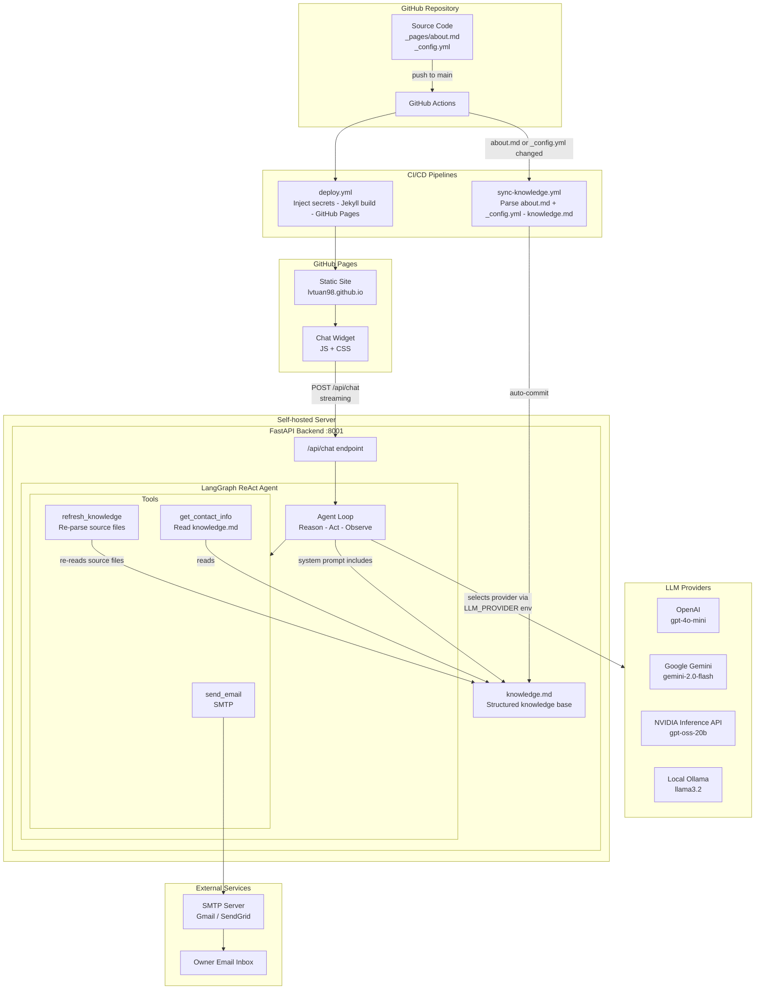

# System Architecture Document

## Overview

A personal academic homepage built with Jekyll and deployed on GitHub Pages, featuring an AI chat assistant powered by a LangGraph agent with tool-calling capabilities.

The system consists of three layers: a static frontend served by GitHub Pages, a self-hosted Python backend running the AI agent, and CI/CD pipelines that keep everything in sync.

---

## Architecture Diagram



---

## 1. Content Layer

All personal content lives in two source files:

| File | Purpose |
|------|---------|
| `_pages/about.md` | Homepage content: bio, publications, awards, education, experience |
| `_config.yml` | Site settings, author profile, social links (as env variable placeholders) |

Sensitive values (email, GitHub username, ORCID, etc.) are stored as placeholders in `_config.yml` and injected at build time via GitHub Secrets or the local `.env` file.

---

## 2. Frontend (Jekyll + GitHub Pages)

### Static Site

Jekyll builds the homepage from `_pages/about.md` using the vendored Minimal Mistakes theme (AcadHomepage fork). The site is a single-page academic portfolio with sections for About, Publications, Awards, Education, and Experience.

### Chat Widget

A self-contained floating chat bubble in the bottom-right corner:

| File | Purpose |
|------|---------|
| `_includes/chat-widget.html` | HTML template, conditionally rendered when `chat_assistant.enabled` is true |
| `assets/js/chat-widget.js` | Chat UI logic, streaming API calls to the backend |
| `assets/css/chat-widget.css` | Widget styling, responsive layout |

The widget is injected into `_layouts/default.html` before `</body>`. It reads `site.chat_assistant.backend_url` from `_config.yml` to know where to send requests.

### Data Flow (Frontend)

```
User types message
    |
    v
POST /api/chat { messages: [...] }
    |
    v
Stream response (text/plain)
    |
    v
Display token-by-token in chat panel
```

---

## 3. Backend (FastAPI + LangGraph Agent)

### Server

A FastAPI application with a single chat endpoint:

| Endpoint | Method | Description |
|----------|--------|-------------|
| `/api/chat` | POST | Accepts `{ messages: [...] }`, streams agent response as `text/plain` |
| `/health` | GET | Returns `{ status: "ok", type: "langgraph-agent" }` |

### LangGraph ReAct Agent

The agent follows a Reason-Act-Observe loop:

```
1. Receive visitor message
2. Load knowledge.md as system prompt context
3. Reason about the query
4. Decide: respond directly OR call a tool
5. If tool called: execute tool, observe result, go to step 3
6. Stream final response back to frontend
```

### Agent Tools

| Tool | Arguments | Description |
|------|-----------|-------------|
| `send_email` | name, email, message | Sends email via SMTP to the site owner. Only called after visitor confirms. |
| `refresh_knowledge` | (none) | Re-reads `_pages/about.md` and `_config.yml`, regenerates `knowledge.md`. |
| `get_contact_info` | (none) | Returns accurate contact details from the knowledge base. |

### LLM Providers

The backend supports 4 LLM providers, selected via the `LLM_PROVIDER` environment variable:

| Provider | Value | Model Class | Endpoint |
|----------|-------|-------------|----------|
| Google Gemini | `gemini` | `ChatGoogleGenerativeAI` | Google API |
| OpenAI | `openai` | `ChatOpenAI` | OpenAI API |
| NVIDIA | `nvidia` | `ChatOpenAI` | `https://inference-api.nvidia.com/v1` |
| Local Ollama | `local` | `ChatOpenAI` | `http://localhost:11434/v1` |

NVIDIA and Ollama use the OpenAI-compatible API format, so they reuse the `ChatOpenAI` class with a custom `base_url`.

### File Structure

```
assistant/
├── main.py              # FastAPI server, /api/chat and /health
├── agent.py             # LangGraph ReAct agent, streaming
├── llm.py               # LLM provider factory (4 providers)
├── tools.py             # Agent tools (send_email, refresh_knowledge, get_contact_info)
├── sync_knowledge.py    # Script to regenerate knowledge.md from source
├── knowledge.md         # Generated knowledge base (agent system prompt)
├── requirements.txt     # Python dependencies
├── .env.example         # Environment variables template
└── README.md            # Setup and usage guide
```

---

## 4. Knowledge Base Pipeline

```
_pages/about.md              _config.yml
       |                          |
       v                          v
  Strip front matter         Extract author block
  Strip Liquid tags          (name, bio, email,
  Strip HTML tags             GitHub, LinkedIn, etc.)
  Clean whitespace
       |                          |
       +----------+---------------+
                  |
                  v
         sync_knowledge.py
                  |
                  v
           knowledge.md
       (clean structured text)
                  |
                  v
       Agent system prompt
```

### Sync Triggers

| Trigger | Mechanism |
|---------|-----------|
| Push to `main` (content changed) | GitHub Actions `sync-knowledge.yml` auto-regenerates and commits |
| Agent tool call | `refresh_knowledge` tool re-runs `sync_knowledge.py` at runtime |
| Manual | `python assistant/sync_knowledge.py` |

---

## 5. CI/CD (GitHub Actions)

### deploy.yml

Triggered on every push to `main`.

1. Checkout repository
2. Inject GitHub Secrets into `_config.yml` via `sed` replacements
3. Build Jekyll site with `actions/jekyll-build-pages`
4. Deploy to GitHub Pages via `actions/deploy-pages`

### deploy-assistant.yml

Triggered on push to `main` when files in `assistant/` change.

1. Checkout repository
2. Setup SSH key from `SSH_PRIVATE_KEY` secret
3. Rsync `assistant/` files to remote server (excludes `.env`, `venv`, `__pycache__`)
4. SSH into remote server:
   - Create/update Python virtualenv
   - Install dependencies
   - Restart the service (systemd if available, otherwise `nohup` fallback)
   - Run health check

### sync-knowledge.yml

Triggered when `_pages/about.md` or `_config.yml` changes on `main`.

1. Checkout repository
2. Install Python + PyYAML
3. Run `python assistant/sync_knowledge.py`
4. If `knowledge.md` changed, auto-commit and push

---

## 6. Environment Variables

### Root `.env` (Jekyll frontend)

| Variable | Description |
|----------|-------------|
| `GOOGLE_SCHOLAR_ID` | Google Scholar user ID |
| `AUTHOR_EMAIL` | Contact email |
| `AUTHOR_GITHUB` | GitHub username |
| `AUTHOR_LINKEDIN` | LinkedIn username |
| `AUTHOR_ORCID` | ORCID identifier |
| `CHAT_BACKEND_URL` | Backend URL (e.g., `http://localhost:8001`) |

### `assistant/.env` (Agent backend)

| Variable | Description |
|----------|-------------|
| `LLM_PROVIDER` | `openai`, `gemini`, `nvidia`, or `local` |
| `OPENAI_API_KEY` | OpenAI API key |
| `GEMINI_API_KEY` | Google Gemini API key |
| `NVIDIA_API_KEY` | NVIDIA Inference API key |
| `LOCAL_LLM_URL` | Ollama endpoint URL |
| `LOCAL_LLM_MODEL` | Ollama model name |
| `CORS_ORIGINS` | Comma-separated allowed origins |
| `EMAIL_TO` | Recipient email for contact messages |
| `SMTP_HOST` | SMTP server hostname |
| `SMTP_PORT` | SMTP server port |
| `SMTP_USER` | SMTP login username |
| `SMTP_PASSWORD` | SMTP login password (app password for Gmail) |

### GitHub Secrets (production)

Configured at Settings > Secrets and variables > Actions:

| Secret | Description |
|--------|-------------|
| `GOOGLE_SCHOLAR_ID` | Google Scholar user ID |
| `AUTHOR_EMAIL` | Contact email |
| `AUTHOR_GITHUB` | GitHub username |
| `AUTHOR_LINKEDIN` | LinkedIn username |
| `AUTHOR_ORCID` | ORCID identifier |
| `CHAT_BACKEND_URL` | Public URL of the assistant backend |
| `SSH_HOST_NAME` | Remote server hostname/IP for assistant deployment |
| `SSH_USER_NAME` | SSH username on the remote server |
| `SSH_PRIVATE_KEY` | SSH private key for server access |

---

## 7. Local Development

### Prerequisites

- Ruby 3.x (via rbenv) or Docker
- Python 3.11+
- An LLM API key (Gemini free tier, or Ollama for fully local)

### Start the backend

```bash
cd assistant
python -m venv venv && source venv/bin/activate
pip install -r requirements.txt
cp .env.example .env   # fill in API keys
uvicorn main:app --host 0.0.0.0 --port 8001
```

### Start the frontend

```bash
# In the project root
cp .env.example .env   # set CHAT_BACKEND_URL=http://localhost:8001
bash run_server.sh     # uses rbenv by default
# or: bash run_server.sh docker
```

### Access

- Homepage: http://localhost:4000
- Chat widget: click the blue bubble at bottom-right
- Backend health check: http://localhost:8001/health

---

## 8. Production Deployment

### Frontend

Deployed automatically to GitHub Pages on push to `main` via `deploy.yml`. No manual steps needed.

### Backend

Requires a self-hosted server. Deploy the `assistant/` directory:

```bash
cd assistant
pip install -r requirements.txt
# Configure .env with production values
uvicorn main:app --host 0.0.0.0 --port 8001
```

Set the `CHAT_BACKEND_URL` GitHub Secret to the server's public URL (e.g., `https://api.yourdomain.com`).

### CORS

The backend allows requests from origins listed in `CORS_ORIGINS`. For production, set this to `https://lvtuan98.github.io`.
